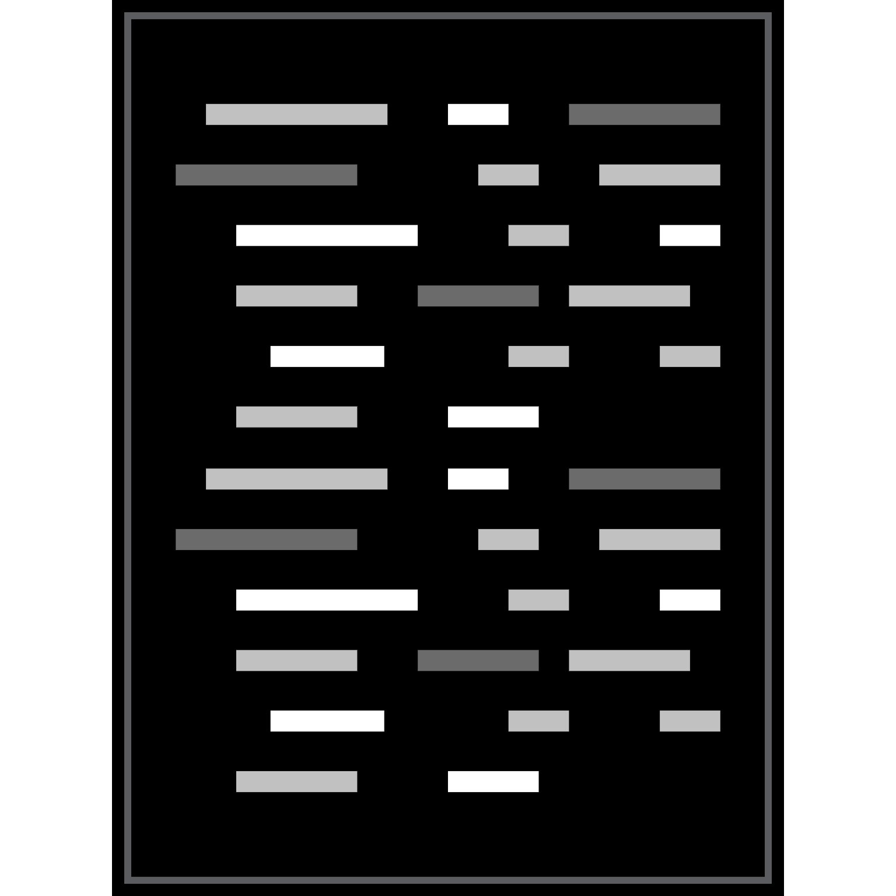

# Introducing Codoc 



Document your python code.

# Setup the workflow: -
1. Clone the repository with this command:
```
git clone git@github.com:heylightning/codoc-ext.git
```
2. Load the extension in your web browser using the following steps:
    * Open your web browser (Chrome, Firefox, etc.).
    * Go to the browser's extension management page. For example, in Chrome, you can navigate to ` chrome://extensions `.
    * Enable the "Developer mode" or a similar option in your browser.
    * Look for an option to "Load unpacked" or "Load extension" and choose that option.
    * Select the folder where you have your extension project (the one containing ` manifest.json `).
3. Your extension should now be loaded and visible in your browser's toolbar. Click on the extension icon to open the extension.

*Note: Requirements and setup are staged for VERSION 1.0.0*

## Description

### Python Code Documentation Extension 🧑‍💻
This Python code documentation extension is designed to analyze a Python code input and generate a documentation object. 

Here is the ` documentationObject ` : - 
```javascript

    const documentationObject = {
        userDefinedFunctions: userDefinedFunctions,
        globalVariables: globalVariables,
        printStatements: printStatements,
        userDefinedClasses: userDefinedClasses,
        importedLibraries: importedLibraries,
        numberOfConditionalStatements: numberOfConditionalStatements,
        numberOfSwitchStatements: numberOfSwitchStatements,
        numberOfLoops: numberOfLoops,
        numberOfReturnStatements: numberOfReturnStatements
    };

```

The documentation object contains the following attributes and also gives the option to download the output as PDF file too:

1. ` userDefinedFunctions ` : This attribute represents an array of user-defined functions present in the code. It includes the names, parameters and details of all functions defined by the user in the input Python code.

2. ` globalVariables ` : This attribute represents an array of global variables used in the code.

3. ` printStatements ` : This attribute contains an array of print statements found in the code. 

4. ` userDefinedClasses ` : This attribute represents an array of user-defined classes in the code.

5. ` importedLibraries ` : This attribute contains an array of imported libraries/modules in the code.

6. ` numberOfConditionalStatements ` : This attribute represents the count of conditional statements in the code. It indicates the number of if/elif/else statements used.

7. ` numberOfSwitchStatements ` : This attribute represents the count of switch statements in the code.

8. ` numberOfLoops ` : This attribute represents the count of loops in the code. It indicates the number of for loops, while loops, or other loop constructs used.

9. ` numberOfReturnStatements ` : This attribute represents the count of return statements in the code. It indicates the number of return statements used within functions or methods.

The Python code documentation extension utilizes these attributes to provide a comprehensive overview of the input code. It helps developers understand the structure, functions, variables, and control flow within the Python code, making it easier to maintain and collaborate on projects.

## LICENSE 📄
MIT License

Copyright (c) 2023 Pratham - heylightning/codoc-ext

Permission is hereby granted, free of charge, to any person obtaining a copy
of this software and associated documentation files (the "Software"), to deal
in the Software without restriction, including without limitation the rights
to use, copy, modify, merge, publish, distribute, sublicense, and/or sell
copies of the Software, and to permit persons to whom the Software is
furnished to do so, subject to the following conditions:

The above copyright notice and this permission notice shall be included in all
copies or substantial portions of the Software.

THE SOFTWARE IS PROVIDED "AS IS", WITHOUT WARRANTY OF ANY KIND, EXPRESS OR
IMPLIED, INCLUDING BUT NOT LIMITED TO THE WARRANTIES OF MERCHANTABILITY,
FITNESS FOR A PARTICULAR PURPOSE AND NONINFRINGEMENT. IN NO EVENT SHALL THE
AUTHORS OR COPYRIGHT HOLDERS BE LIABLE FOR ANY CLAIM, DAMAGES OR OTHER
LIABILITY, WHETHER IN AN ACTION OF CONTRACT, TORT OR OTHERWISE, ARISING FROM,
OUT OF OR IN CONNECTION WITH THE SOFTWARE OR THE USE OR OTHER DEALINGS IN THE
SOFTWARE.